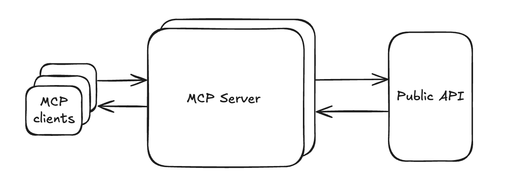

# Vectra AI On-Premise MCP Server

This project implements an [MCP server](https://modelcontextprotocol.io/docs/getting-started/intro) for the [Vectra AI On-Premise Platform](https://www.vectra.ai).

# What is Vectra AI On-Premise MCP?
An MCP server that connects AI assistants to your Vectra AI On-Premise security platform, enabling intelligent analysis of threat detection data, security insights, and automated incident response workflows. Compatible with Claude, ChatGPT, Cursor, VS Code and other MCP-enabled AI tools.

<p align="center">
  
</p>

# What can you do with Vectra AI On-Premise MCP?

* Investigate threats in natural language
* Search and analyze accounts, hosts, and detections
* Manage investigation assignments and notes
* Correlate and analyze security data using prompts
* Dynamically build advanced visualizations for analysis
* Generate investigation reports from natural language

# Setup - Host Locally

## Prerequisites

1. **Install Python**
Check .python-version file for the required version

2. **Install uv** - Python package manager
```
# On macOS/Linux
curl -LsSf https://astral.sh/uv/install.sh | sh

# On Windows
powershell -c "irm https://astral.sh/uv/install.ps1 | iex"

# Or via pip
pip install uv
```

## Setup Steps
1. **Clone/Download the project** to your local machine
2. **Navigate to the project directory:**
```
cd your-project-directory
```

3. **Configure environment variables:**
```
# Create a .env file with your Vectra On-Premise credentials
cat > .env << EOF
VECTRA_BASE_URL=https://your-vectra-instance.com
VECTRA_API_KEY=your_api_key_here
VECTRA_API_VERSION=v2.5
VECTRA_VERIFY_SSL=true
EOF
```
Then edit the .env file with your actual Vectra AI On-Premise Platform credentials. 
Required variables to update:

* `VECTRA_BASE_URL`: Your Vectra On-Premise portal URL
* `VECTRA_API_KEY`: Your API key from Vectra On-Premise

Optional variables:
* `VECTRA_VERIFY_SSL`: Set to `false` to disable SSL certificate verification (useful for self-signed certificates or internal deployments)

4. **Create and activate a virtual environment:**
```
uv venv

# Activate it:
# On macOS/Linux:
source .venv/bin/activate

# On Windows:
.venv\Scripts\activate
```

5. **Install dependencies:**
```
uv sync
```
This will install all dependencies specified in pyproject.toml using the exact versions from uv.lock.

6. **Run the application:**

The server supports multiple transport protocols:

```bash
# Run with stdio transport (default, for Claude Desktop)
python server.py
python server.py --transport stdio

# Run with SSE transport (for HTTP-based MCP clients)
python server.py --transport sse --host 0.0.0.0 --port 8000

# Run with streamable-http transport (for production HTTP deployments)
python server.py --transport streamable-http --host 0.0.0.0 --port 8000

# Enable debug logging
python server.py --debug
```

**Transport Options:**
- **stdio**: Standard input/output communication (default, used by Claude Desktop)
- **sse**: Server-Sent Events over HTTP (good for web-based clients)
- **streamable-http**: Streamable HTTP transport (recommended for production HTTP deployments)

**Environment Variables:**
You can also configure the server using environment variables:
```bash
export VECTRA_MCP_TRANSPORT=streamable-http
export VECTRA_MCP_HOST=0.0.0.0
export VECTRA_MCP_PORT=8000
export VECTRA_MCP_DEBUG=true
python server.py
```

## MCP Configuration for Claude Desktop
7. **Add MCP Server to Claude Desktop:**
```
# On macOS:
# Open Claude Desktop configuration file
code ~/Library/Application\ Support/Claude/claude_desktop_config.json

# On Windows:
# Open Claude Desktop configuration file
notepad %APPDATA%/Claude/claude_desktop_config.json
```

Add the following configuration to the `mcpServers` section (update the paths to match your setup):
```
{
  "mcpServers": {
    "vectra-ai-onpremise-mcp": {
      "command": "/path/to/your/uv/binary",
      "args": [
        "--directory",
        "/path/to/your/project/directory",
        "run",
        "server.py"
      ]
    }
  }
}
```

Example with actual paths:
```
{
  "mcpServers": {
    "vectra-ai-onpremise-mcp": {
      "command": "/Users/yourusername/.local/bin/uv",
      "args": [
        "--directory",
        "/Users/yourusername/path/to/vectra-mcp-project",
        "run",
        "server.py"
      ]
    }
  }
}
```

8. **Debug - Find your uv installation path:**
```
# Find where uv is installed
which uv
# or
where uv
```

9. **Debug - Get your project's absolute path:**
```
# From your project directory, run:
pwd
```

10. **Restart Claude Desktop** to load the new MCP server configuration.

## Other MCP Client Setup
Once configured, you should be able to use Vectra AI On-Premise Platform capabilities directly within Claude Desktop or other MCP clients through this MCP server!

For other MCP clients besides Claude Desktop, refer to the documentation links below:

| MCP Client | Documentation Link |
|------------|-------------------|
| **General MCP Setup** | [https://modelcontextprotocol.io/quickstart/user](https://modelcontextprotocol.io/quickstart/user) |
| **Cursor** | [https://docs.cursor.com/en/context/mcp#using-mcp-json](https://docs.cursor.com/en/context/mcp#using-mcp-json) |
| **VS Code** | [https://code.visualstudio.com/docs/copilot/chat/mcp-servers#_add-an-mcp-server](https://code.visualstudio.com/docs/copilot/chat/mcp-servers#_add-an-mcp-server) |

For other MCP clients, refer to their respective documentation. The general pattern is similar - you'll need to specify the command and arguments to run the MCP server with the same configuration structure.

# Setup - Docker Deployment

For production deployments or easier setup, you can run the Vectra AI On-Premise MCP Server using Docker. We provide two options:

## Option 1: Using Pre-built Images (Recommended)

The easiest way to get started is using our pre-built Docker images from GitHub Container Registry.

### Prerequisites
- [Docker Desktop](https://www.docker.com/products/docker-desktop/) or Docker Engine

### Quick Start Steps

1. **Configure environment variables:**
```bash
# Create a .env file with your Vectra On-Premise credentials
cat > .env << EOF
VECTRA_BASE_URL=https://your-vectra-instance.com
VECTRA_API_KEY=your_api_key_here
VECTRA_API_VERSION=v2.5
VECTRA_VERIFY_SSL=true
EOF
```
Then edit the `.env` file with your actual Vectra AI On-Premise Platform credentials.

2. **Run with pre-built image:**

#### Streamable HTTP Transport (Recommended for Production)
```bash
docker run -d \
  --name vectra-onpremise-mcp-server-http \
  --env-file .env \
  -e VECTRA_MCP_TRANSPORT=streamable-http \
  -e VECTRA_MCP_HOST=0.0.0.0 \
  -e VECTRA_MCP_PORT=8000 \
  -p 8000:8000 \
  --restart unless-stopped \
  ghcr.io/vectra-ai-research/vectra-ai-mcp-server-qux:latest
```

#### SSE Transport (Server-Sent Events)
```bash
docker run -d \
  --name vectra-onpremise-mcp-server-sse \
  --env-file .env \
  -e VECTRA_MCP_TRANSPORT=sse \
  -e VECTRA_MCP_HOST=0.0.0.0 \
  -e VECTRA_MCP_PORT=8000 \
  -p 8000:8000 \
  --restart unless-stopped \
  ghcr.io/vectra-ai-research/vectra-ai-mcp-server-qux:latest
```

#### Stdio Transport (For Local MCP Clients)
```bash
docker run -d \
  --name vectra-onpremise-mcp-server-stdio \
  --env-file .env \
  -e VECTRA_MCP_TRANSPORT=stdio \
  --restart unless-stopped \
  ghcr.io/vectra-ai-research/vectra-ai-mcp-server-qux:latest
```

3. **Or use Docker Compose (Alternative):**

Create a `docker-compose.yml` file:
```yaml
version: '3.8'
services:
  vectra-onpremise-mcp-server:
    image: ghcr.io/vectra-ai-research/vectra-ai-mcp-server-qux:latest
    container_name: vectra-onpremise-mcp-server
    env_file: .env
    environment:
      - VECTRA_MCP_TRANSPORT=streamable-http
      - VECTRA_MCP_HOST=0.0.0.0
      - VECTRA_MCP_PORT=8000
    ports:
      - "8000:8000"
    restart: unless-stopped
```

Then run:
```bash
docker-compose up -d
```

**Available Tags:**
- `latest`: Latest stable build from main branch
- `main`: Latest build from main branch (same as latest)  
- `v*`: Specific version tags (e.g., v1.0.0)

> 💡 **Tip**: Pre-built images are automatically built and published via GitHub Actions whenever code is pushed to the main branch or when releases are tagged. This ensures you always get the latest tested version without needing to build locally.

## Option 2: Build from Source

For development or customization, you can build the Docker image from source.

### Prerequisites

1. **Install Docker and Docker Compose**
   - [Docker Desktop](https://www.docker.com/products/docker-desktop/) (includes Docker Compose)
   - Or install Docker Engine and Docker Compose separately on Linux

### Build from Source Steps

1. **Clone/Download the project** to your local machine
2. **Navigate to the project directory:**
```bash
cd your-project-directory
```

3. **Configure environment variables:**
```bash
# Create a .env file with your Vectra On-Premise credentials
cat > .env << EOF
VECTRA_BASE_URL=https://your-vectra-instance.com
VECTRA_API_KEY=your_api_key_here
VECTRA_API_VERSION=v2.5
VECTRA_VERIFY_SSL=true
EOF
```
Then edit the `.env` file with your actual Vectra AI On-Premise Platform credentials.

4. **Build and run with Docker:**

```bash
# Build the image
docker build -t vectra-onpremise-mcp-server .
```

5. **Run the locally built image:**

Choose your transport mode and run with the locally built image:

#### Streamable HTTP Transport
```bash
docker run -d \
  --name vectra-onpremise-mcp-server-http \
  --env-file .env \
  -e VECTRA_MCP_TRANSPORT=streamable-http \
  -e VECTRA_MCP_HOST=0.0.0.0 \
  -e VECTRA_MCP_PORT=8000 \
  -p 8000:8000 \
  --restart unless-stopped \
  vectra-onpremise-mcp-server
```

#### SSE Transport
```bash
docker run -d \
  --name vectra-onpremise-mcp-server-sse \
  --env-file .env \
  -e VECTRA_MCP_TRANSPORT=sse \
  -e VECTRA_MCP_HOST=0.0.0.0 \
  -e VECTRA_MCP_PORT=8000 \
  -p 8000:8000 \
  --restart unless-stopped \
  vectra-onpremise-mcp-server
```

#### Stdio Transport
```bash
docker run -d \
  --name vectra-onpremise-mcp-server-stdio \
  --env-file .env \
  -e VECTRA_MCP_TRANSPORT=stdio \
  --restart unless-stopped \
  vectra-onpremise-mcp-server
```

## Docker Environment Variables

The Docker container supports all the same environment variables as the local setup, plus additional MCP server configuration:

### MCP Server Configuration
- `VECTRA_MCP_TRANSPORT`: Transport protocol (`stdio`, `sse`, or `streamable-http`) - default: `stdio`
- `VECTRA_MCP_HOST`: Host to bind to for HTTP transports - default: `0.0.0.0`
- `VECTRA_MCP_PORT`: Port for HTTP transports - default: `8000`
- `VECTRA_MCP_DEBUG`: Enable debug logging - default: `false`

### Accessing the HTTP Server

When running with HTTP transports (`sse` or `streamable-http`), the MCP server will be available at:
- **Streamable HTTP**: `http://localhost:8000/mcp`
- **SSE**: `http://localhost:8000/sse`

## MCP Client Configuration for Docker

For HTTP-based MCP clients connecting to the Dockerized server, use the appropriate endpoint:

```json
{
  "mcpServers": {
    "vectra-ai-onpremise-mcp": {
      "transport": {
        "type": "http",
        "url": "http://localhost:8000/"
      }
    }
  }
}
```

## Docker Health Checks

The Docker container includes health checks that will verify the server is running properly:
- For `stdio` transport: Always reports healthy (no HTTP endpoint to check)
- For HTTP transports: Checks HTTP endpoint availability

> **Note**: MCP (Model Context Protocol) is an emerging and rapidly evolving technology. Exercise caution when using this server and follow security best practices, including proper credential management and network security measures.